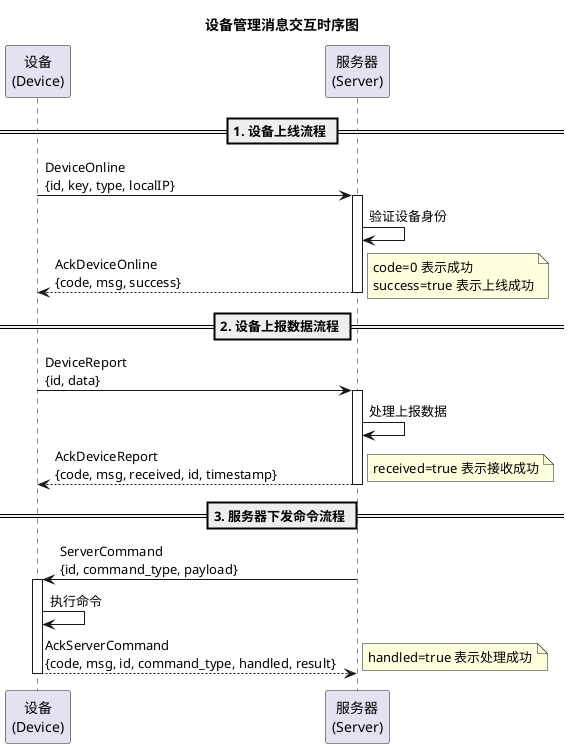

## 目录结构

```
come.1.json/
├── come_1.h              # 基础消息定义（可被不同序列化方式复用）
├── json/                 # JSON 序列化实现
│   ├── come.1.json.h     # JSON 编解码器接口
│   ├── come.1.json.cpp   # JSON 编解码器实现
│   ├── ut-come.1.json.cpp # JSON 测试程序
│   └── Makefile          # JSON 版本的构建文件
├── README.md             # 本文档
└── i-design.md           # 设计文档
```


## 消息一览
| 序号 | 说明                     | 消息名称           | 返回消息名称         |
|------|--------------------------|--------------------|----------------------|
| 1    | 基础消息类               | `MsgCome`          | —                    |
| 2    | 应答消息基类             | `AckMsgCome`       | —                    |
| 3    | 设备上线消息             | `DeviceOnline`     | `AckDeviceOnline`    |
| 4    | 设备上报消息             | `DeviceReport`     | `AckDeviceReport`    |
| 5    | 服务器下发命令           | `ServerCommand`    | `AckServerCommand`   |

## 消息交互时序图


