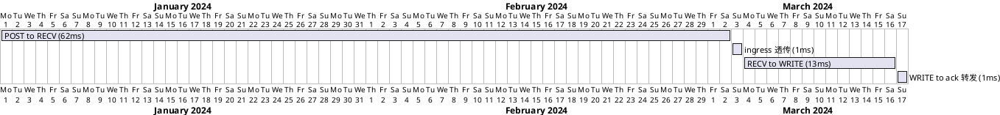

# Edge frpc 远程配置

**版本**: 1.2
**日期**: 2026-09-11
**状态**: 已实现 · 功能与并发正确性通过实测

> **v1.2 按代码同步说明**（2026-09-11）：本文档此前部分内容与实际实现存在漂移，本次按源码核对并修正，关键差异：
> - `config_status` 合法取值实为 `unknown / configuring / confirmed / pending / config_failed`（**无 `configured`**；"下发成功已确认"用 `confirmed`，"离线暂存待下发"用 `pending`）。
> - Edge 另有 `confirmed` 字段表示设备白/黑名单：`99=pending`、`1=confirmed(白名单)`、`0=rejected(黑名单)`。`confirmed=0` 的 edge 每次上线会被 manager 下发 `manager.edge.kick` 踢下线（详见"异常处理"）。
> - Edge 侧配置文件名按边缘 ID 生成：`./shpc/shpc.<edge_id>.json`（如 `shpc.edge001.json`），不再写死单个 `shpc.a1.json`。
> - touch_manager 默认监听 `18050`（`PORT` 可覆盖，测试脚本用 `18051`）。
> - 配置下发支持 manager↔ingress 断线自动重连；未确认(confirmed)配置的重复推送节流阈值可在 `config.py` 用 `CONFIG_CONFIRM_TIMEOUT` 配置(范围 1~3600 秒，0=关闭节流)。

## 功能/目的

实现 touch_manager 对 Edge 设备 frpc 配置的远程管理能力：
- 远程配置下发（写配置）
- 配置结果反馈
- 配置内容查询

## 架构图

```text
                                    +-----------------------+
                                    | Web UI / 测试工具     |
                                    +-----------------------+
                                             ▲
                                             │ REST API (HTTP/JSON)
                                             │
+------------------+               +------------------+
| touchEdge        |               | Touch Manager    |
| (C++)            |               | (Python)         |
+------------------+               +------------------+
        │                                ▲
        │                                │
        │ WebSocket                      │ WebSocket
        │ ConfigUpdate_tunnelService     │ ConfigUpdate_tunnelService
        │ AckConfigUpdate                │ AckConfigUpdate
        │                                │
        └───────────────┬────────────────┘
                        │
                        ▼
               +------------------+
               | touchIngress     |
               | (C++)            |
               +------------------+
```

**架构说明**：
- **touchEdge ↔ touchIngress**：WebSocket (come.1 JSON-RPC 2.0)，配置下发、配置查询、结果反馈
- **touchIngress ↔ touchManager**：WebSocket (come.1 JSON-RPC 2.0)，配置消息透传
- **touchManager ↔ Web UI**：REST API (HTTP/JSON)，配置界面交互
- **touchEdge 与 touchManager 不直接通信**：配置消息通过 **touchIngress** 转发

---

## 各层职责

### 1. touchEdge（Edge，终端）
- **新增功能**：
  - 处理 `ConfigUpdate_tunnelService` 消息
  - 将 `ConfigUpdate_tunnelService` 转换为 `FrpcConfig`
  - 将 `FrpcConfig` 编码为 JSON 字符串
  - 写入配置文件（路径按边缘 ID 生成：`./shpc/shpc.<edge_id>.json`，由 `FunRegisterCli::get_frpc_config_path()` 提供）
  - 回复 `AckConfigUpdate`（成功/失败）
  - 处理配置查询请求，读取并返回配置文件内容

### 2. touchIngress（Ingress Service，接入层）
- **新增功能**：
  - 透传 `ConfigUpdate_tunnelService` 消息（Manager → Edge）
  - 透传 `AckConfigUpdate` 消息（Edge → Manager）
  - 透传配置查询请求和响应

### 3. touchManager（Management Service，管理服务）
- **新增功能**：
  - **REST API**（遵循全系统约定：边缘 ID 一律放在请求 body，不放 URL 路径；操作名用 RPC 风格的 `POST /api/v1/edges/<action>`）：
    - `POST /api/v1/edges/config/update` - body `{edge_id, config_type, config_content}`，保存并下发 frpc 配置
    - `POST /api/v1/edges/config/get` - body `{edge_id}`，查询 frpc 配置（先返回数据库，后台异步刷新）
    - 说明：早期版本曾用 `POST/GET /api/v1/edges/<edge_id>/config` 路径式接口，与约定冲突，**已废弃**，统一迁移到上述 body 式接口（见「第三阶段」接口约定）。
  - **数据库扩展**：
    - `edge_configs` 表（EdgeConfig 模型）：存储边缘配置（edge_id, config_json, version, updated_at, configuring_since）
    - `Edge` 模型新增字段：
      - `config_status`：'unknown'（未知）, 'configuring'（下发中）, 'confirmed'（已确认）, 'pending'（离线暂存待下发）, 'config_failed'（下发失败）
      - `config_version`：配置版本号
      - `confirmed`：设备白/黑名单标记 `99=pending, 1=confirmed(白名单), 0=rejected(黑名单)`
  - **配置持久化**：
    - 用户保存配置时，先写入数据库，再下发给在线 Edge
    - 离线 Edge 的配置暂存数据库，待上线后下发
    - 查询配置时，先返回数据库数据，后台异步从 Edge 刷新

注：Web UI 由 touchManager 统一提供，详见 [spec-design.md](../test/touch/spec/spec-design.md)

---

## 设计原则

### 配置存储原则

**核心原则**：配置在 touchManager 数据库中持久化存储，Edge 本地为运行时副本。

- **设计理由**：
  - touchManager 需要持久化保存配置，支持离线边缘的配置缓存
  - 用户首次打开配置界面时，从数据库加载配置（无需等待 Edge 响应）
  - Edge 离线时，配置可以暂存，待 Edge 上线后下发
  - 查询时先展示数据库中的配置，再从 Edge 异步刷新

- **实现方式**：
  - touchManager 数据库存储配置的完整 JSON 表示
  - 用户保存配置时，先写入数据库，再下发给 Edge
  - 查询配置时：
    1. 立即返回数据库中的配置（同步）
    2. 后台向 Edge 发起查询，更新数据库（异步）
  - 配置文件权限设置为 0644
  - Edge 侧配置文件路径按边缘 ID 生成：`./shpc/shpc.<edge_id>.json`（`FunRegisterCli::get_frpc_config_path()`），多 Edge 各自独立、互不覆盖，便于横向扩展

---

## 详细设计

### 消息格式

**ConfigUpdate_tunnelService**（Manager → Edge）:
```json
{
  "jsonrpc": "2.0",
  "method": "edge.config.update",
  "params": {
    "edge_id": "edge001",
    "config_type": "tunnelService",
    "version": 1,
    "access_token": "test_access_token",
    "configContent": {
      "services": [
        {
          "serviceName": "tunnelService",
          "tunnelService": {
            "version": "1.0",
            "endpoint": {
              "host": "10.220.42.139",
              "port": 50400
            },
            "localManagement": {
              "bindAddress": "127.0.0.1",
              "bindPort": 17400
            },
            "security": {
              "authMethod": "token",
              "credential": "737da3d24390c0f8601198eb5568e361046d92224266f44dcc2bc7fb13a2f4cc",
              "enableTls": true
            },
            "accessPolicies": [
              {
                "policyId": "w-tcp-51422",
                "protocol": "tcp",
                "description": "pss service",
                "exposedPort": 51422,
                "targetService": {
                  "ip": "127.0.0.1",
                  "port": 55555
                }
              }
            ]
          }
        }
      ]
    }
  },
  "id": 12345
}
```

**AckConfigUpdate**（Edge → Manager）:
```json
{
  "jsonrpc": "2.0",
  "result": {
    "code": 0,
    "message": "success"
  },
  "id": 12345
}
```

---

## 流程设计

### 1. 远程配置下发流程

```
Web UI → touch_manager（写数据库） → touchIngress → touchEdge → 写入文件 → 反馈结果
```

**步骤**：
1. 用户在 Web UI 填写 frpc 配置，点击保存
2. touch_manager 将配置写入数据库（edge_config 表）
3. 检查 Edge 是否在线：
   - Edge 在线：构造 `ConfigUpdate_tunnelService` 消息，通过 WebSocket 发送
   - Edge 离线：配置暂存数据库，等待 Edge 上线后下发
4. touchIngress 透传给 touchEdge
5. touchEdge 处理：
   - decode JSON → `ConfigUpdate_tunnelService`
   - `toFrpcConfig()` 转换为 `FrpcConfig`
   - `encode` 为 JSON 字符串
   - 写入配置文件（路径 `./shpc/shpc.<edge_id>.json`）
   - 回复 `AckConfigUpdate(code=0, message="success")`
6. touchIngress 将 `AckConfigUpdate` 转发给 touch_manager
7. touch_manager 更新数据库状态：`config_status = 'confirmed'`（并递增 `config_version`）
8. Web UI 显示配置成功

**异常处理**：
- Edge 离线：配置写入数据库，`config_status='pending'`，等待 Edge 上线后下发
- Edge 为黑名单（`confirmed=0`）：manager 下发 `manager.edge.kick`，ingress 踢掉并回 ack `"Edge rejected by admin" (40001)`——该 edge 会持续"上线→被踢→重连"，除非把 `confirmed` 修正为非 0 值
- Ingress 未连接：REST API 返回 50004 "Ingress not connected"
- 文件写入失败：Edge 回复 `AckConfigUpdate(code=-2, message="Failed to write config file")`，manager 置 `config_status='config_failed'`
- 消息超时：REST API 返回 50007 "Config update timeout"，数据库标记为"configuring"
- 重复推送节流：edge 仍处 `configuring` 时再次 POST 同一条配置，距上次下发超过 `CONFIG_CONFIRM_TIMEOUT`(默认 10s，范围 1~3600，0=不做节流每次都推) 才允许重推；否则返回 50008 "Config update in progress"
- manager↔ingress 断线：manager 自动重连（默认每 10s 重试），断线期间该 ingress 下所有 edge 标记 offline，重连后恢复

---

### 2. 配置查询流程

```
Web UI → touch_manager（返回数据库） → 后台异步查询 → touchIngress → touchEdge → 刷新数据库
```

**步骤**：
1. 用户在 Web UI 点击"配置"或"从设备加载"
2. touch_manager 从数据库查询配置（edge_config 表）
   - 数据库有数据：立即返回配置（同步）
   - 数据库无数据：返回空配置（edge_id 存在但 config_json 为空）
3. Web UI 展示配置（首次可能为空）
4. 后台异步发起查询（如果 Edge 在线）：
   - touch_manager 发送配置查询请求给 touchIngress
   - touchIngress 透传给 touchEdge
   - touchEdge 处理：
     - 读取 `./shpc/shpc.<edge_id>.json`（按自身边缘 ID 定位）
     - parse JSON → `FrpcConfig`
     - `fromFrpcConfig()` 转换为 `ConfigUpdate_tunnelService` 格式
     - 回复配置数据
   - touchIngress 将响应转发给 touch_manager
   - touch_manager 更新数据库：写入/刷新 config_json
   - Web UI 通过轮询或 WebSocket 接收更新，刷新表单

**异常处理**：
- 数据库无配置：返回空配置（`{}` 或 `null`）
- Edge 离线：返回数据库配置，标记"设备离线，无法刷新"
- 配置文件不存在：Edge 回复错误，数据库保持原数据或标记"文件不存在"

---

## 实现计划

> 状态：第一、二阶段已实现并通过实测；第三阶段（frpc 配置编辑 Web UI）尚未实现。

### 数据库设计（对应 `database.py` 实际模型，已实现）

**`edge_configs`（EdgeConfig 模型，存储配置）**：
```python
edge_id     : PK+FK→edges, unique   # 边缘 ID（唯一）
config_json : Text, nullable        # frpc 配置 JSON 字符串
version     : Integer, default 0    # 配置版本号
updated_at  : DateTime              # 更新时间
configuring_since : BigInteger      # UTC 毫秒时间戳，用于"未确认超时重推"判断
```

**`edges`（Edge 模型）新增字段**：
```python
config_status  : String(20), default 'unknown'  # unknown/configuring/confirmed/pending/config_failed
config_version : Integer, default 0             # 配置版本号
confirmed      : Integer, default 99            # 99=待确认, 1=已确认(白名单), 0=黑名单(拒绝)
```

### 第一阶段：基础功能（✅ 已实现）
- [x] Edge 侧：CFunRegisterCli 实现 `ConfigUpdate_tunnelService` 处理
- [x] Edge 侧：实现 `write_frpc_config_file()` 函数（按 `shpc/shpc.<edge_id>.json` 写盘）
- [x] Ingress 侧：透传 `ConfigUpdate/AckConfigUpdate` 消息
- [x] touch_manager 侧：
  - [x] 新增 REST API：`POST /api/v1/edges/config/update`（body 带 edge_id）✅ 已迁移
  - [x] 数据库扩展：创建 `edge_configs` 表，给 `edges` 添加 `config_status`、`config_version`、`confirmed` 字段
  - [x] 配置保存逻辑：写数据库 → 检查在线 → 下发配置

### 第二阶段：查询功能（✅ 已实现）
- [x] Edge 侧：实现配置查询处理（`edge.config.query`）与 `read_frpc_config_file()`
- [x] Ingress 侧：透传查询请求/响应
- [x] touch_manager 侧：
  - [x] 新增 REST API：`POST /api/v1/edges/config/get`（body 带 edge_id）✅ 已迁移
  - [x] 配置查询逻辑：先返回数据库 → 在线时线程安全地 `edge.config.query` 刷新（同步/异步，见「异步回填 bug 修复」）

### 第三阶段：用户界面（frpc 配置编辑，✅ 已实现）
> 已实现独立的 frpc 配置编辑页（`templates/edge_config.html` + 路由 `GET /edges/config`），并在 `edges.html` 设备列表每行「操作」列新增「配置」按钮跳转进入。配置按类型分组折叠展示（当前为「SHPC 配置」面板，未来多种配置类型可平铺并列）。以下为实际实现与约定。


**接口约定**（遵循全系统 REST 约定：边缘 ID 放 body，操作名用 RPC 风格 `POST /api/v1/edges/<action>`；`config_content` 采用嵌套 `services[].tunnelService` 结构）：
- **保存并下发** `POST /api/v1/edges/config/update`
  - body：
    ```json
    {
      "edge_id": "edge001",
      "config_type": "tunnelService",
      "config_content": {
        "services": [
          {
            "serviceName": "tunnelService",
            "tunnelService": {
              "endpoint": {"host": "10.220.42.139", "port": 50400},
              "localManagement": {"bindAddress": "127.0.0.1", "bindPort": 17400},
              "security": {"authMethod": "token", "credential": "...", "enableTls": true},
              "accessPolicies": [
                {"policyId": "w-tcp-51422", "protocol": "tcp",
                 "exposedPort": 51422, "description": "pss service",
                 "targetService": {"ip": "127.0.0.1", "port": 55555}}
              ]
            }
          }
        ]
      }
    }
    ```
  - 响应：在线 `{"code":0,...}`；离线暂存 `config_status='pending'`；参数错误 `40001`；Edge 不存在 `40002`
- **查询配置** `POST /api/v1/edges/config/get`
  - body：`{"edge_id": "edge001"}`
  - 响应：返回配置（含 `config_status`/`config_version`）。
    - DB 已有配置 → 直接返回 DB 快照，后台线程安全地 `edge.config.query` 刷新一次；
    - **DB 无配置且 Edge 在线** → **同步**查询一次 edge 本地配置并返回（消除"首次打开 token 空、需等异步回填"的问题），并回填 DB。
    - 详见「异步回填 bug 修复」小节。
- **同步配置** `POST /api/v1/edges/config/sync`（✅ 2026-09-12 新增：以 **edge 前端**为准）
  - body：`{"edge_id": "edge001"}`
  - 语义：与 `config/get`（以**数据库**为准）相反，`config/sync` **以 edge 前端的本地真实配置为准**，展示 edge 实际运行的配置，方便用户在"数据库版本"与"edge 实际版本"间选择。
  - 响应字段：
    - `config`：edge 前端真实配置（frpc 权威结构）；取不到则为 `null`。
    - `differ`：与数据库配置归一化比较结果——`true`(不一致)/`false`(一致)/`None`(无法比较)。
    - `sync_state`：`same`(一致)/`differ`(不一致)/`unreadable`(edge 在线但本地配置不可读或缺失)/`unreachable`(edge 离线或无法通信)。
    - `edge_reachable`：是否成功建立通信（edge 是否"在线可达"）。
    - `edge_unreadable`：edge 在线但本地配置文件缺失/解析失败。
    - `sync_at`：本次同步核对的 UTC **毫秒时间戳**，持久化到 `edge_configs.synced_at`（BigInteger 毫秒），供前端展示"最后同步时间"。
  - 一致性核对逻辑：edge 在线且拿到 config → 与 DB 比较得 `differ`；edge 在线但返回 error（文件缺失）→ `unreadable`；ingress 未连接/超时 → `unreachable`。**注意区分"离线"与"在线但配置不可读"**——二者前端提示不同。
- **迁移说明**：早期版本 `POST/GET /api/v1/edges/<edge_id>/config` 路径式接口与约定冲突，已废弃；代码需迁移到上述 body 式接口后再接入 UI。

**UI 实现**（✅ 已落地）：
- [x] `edges.html` 设备列表每行「操作」列新增「配置」按钮（`settings` 图标），点击跳转 `GET /edges/config?edge_id=<id>`（页面路由，edge_id 走 URL 查询参数——页面导航非 API，不违反"edge_id 放 body"约定）
- [x] 新增独立配置页 `templates/edge_config.html`：配置类型按需分组折叠（当前「SHPC 配置」面板，默认折叠；未来多种类型可平铺并列）
- [x] 表单字段：服务端连接（`endpoint.host/port`）、本地管理（`localManagement.bindAddress/bindPort`）、安全（`security.authMethod`/`credential`/`enableTls`，Token 输入框带明/密文眼睛切换）、访问策略/代理（`accessPolicies[]`，可动态增删行）
- [x] 配置状态显示：顶部 meta 徽章展示 `config_status`/`version`；加载时按状态给不同提示
- [x] 异步刷新：保存后 1s 短轮询 `config/get` 直到 `confirmed` 或 `config_failed`
- [x] **三个动作按钮（每个配置面板内各自独立）**：「从平台加载」(从**数据库**) /「从设备同步」(从 **edge 前端**) /「保存并下发」，遵循"每类配置独立"理念，未来新增配置类型各自带操作按钮：
  - **从平台加载** = `config/get`，以数据库为准（DB→edge 在线回填→后端默认模板），表单展示 DB 值；后端默认模板由 `_default_edge_config()` 定义（serverPort=17400、无 token/proxy、tls 开、webServer.port=17401）。
  - **从设备同步** = `config/sync`，以 edge 前端为准，点击后按钮倒计时 3s（"获取中 (3s)→…"）自动获取一次并展示 edge 真实配置；按 `sync_state` 提示"一致/不一致/格式异常(bad)/配置不存在(missing)/离线不可达"，末尾附最后同步时间。**离线设备不显示此按钮**（由页面路由 `edge_online` 决定，Jinja `` 渲染时隐藏）——离线本就无法同步，故不提供该功能。
  - **保存并下发** = `config/update`。
  - 已移除原「重置」(清空表单) 按钮——"从平台加载"即承担"取回一份配置"的语义。

**交互流程（实际实现）**：
1. 设备列表「配置」按钮 → 跳转独立配置页
2. 页面打开自动 `POST /api/v1/edges/config/get` 加载当前配置；若 DB 空，后端同步查询 edge 本地配置返回、前端兜底重试
3. 用户编辑后点「保存并下发」→ `POST /api/v1/edges/config/update`，显示返回 `code`/`version`
4. 保存后 `config_status` 经历 `configuring → confirmed`，前端轮询直至落下

**关键语义：`config_status` 的 `unknown` 与「以 edge 前端为准」的一致性核对**
- `unknown` = 该 Edge **从未经 manager 下发并确认**（配置可能是从 edge 本地回读/同步的），是正常初始状态。
- **以 edge 前端为准**：`config/get` 加载时会做一致性核对——同时读 DB 配置与 edge 在线本地配置，归一化后比较。核对结果以 `config_sync` 字段返回（见下）。
- `config/get` 响应的一致性核对字段 `config_sync`，取值：
  - `matched` — 在线且 DB 与 edge 本地**一致** → `config_status` 置 `confirmed`，`config_matched=true`。
  - `mismatch` — 在线且 DB 与 edge 本地**不一致** → 保持原状态（`unknown` 仍 `unknown`），`config_matched=false`，前端提示"待同步"。
  - `missing` — 在线但 edge 本地配置文件**不存在/无法打开**（JSON-RPC 顶层 error）→ `config_matched=false`。
  - `bad` — 在线且 edge 本地配置文件存在但**解析失败**（JSON 格式异常，`result.config_error`）→ `config_matched=false`，前端提示"格式异常"。
  - `None` — 离线或查询超时/无响应（无法核对），保持原状态。
- **DB 空**（从未下发过）→ 回填 edge 本地配置并直接返回真实配置，不改 confirmed。
- 「保存并下发」仍走 `下发 → edge 写盘 → AckConfigUpdate → confirmed` 流程（实测：edge007 下发后 `unknown → confirmed`，version 0→1）。
- 页面在 `unknown` 且已有配置时给出明确提示，避免误导。

**一致性核对实现（`edges.py::get_edge_config`）**：
- 初始化 `config_matched_val=None; final_status=edge.config_status`；仅当 Edge 在线且已连接时同步 `query_edge_config(edge_id, timeout=10)`。
- DB 空 → 回填：`if not config_data: config_data = edge_online_cfg ... db.commit()`。
- 比较用归一化权威结构 `_canonical_config()`（两侧都转成 frpc 权威结构再判等）。
- 一致 → `config_matched=True`，若当前非 `confirmed` 则 `_set_edge_config_status(edge_id,'confirmed')`，`final_status='confirmed'`；否则 `config_matched=False`，`final_status` 保持 DB 原状态。
- **区分 edge 本地"缺失"与"格式错"两种不可读情况**：edge 返回 **JSON-RPC 顶层 error**（文件不存在/无法打开）→ `missing`；edge 返回 **success 响应但 `result.config_error`**（文件存在但解析失败）→ `bad`。二者都置 `config_matched=false`、`config_sync` 分别取 `missing`/`bad`，前端据此给出不同提示（此前统一归为 missing，导致 edge002 这类"格式错"被误报为"配置不存在"）。
- **已删除原后台 `refresh_config` 线程**：它曾用线程安全方式（或旧版 `new_event_loop`）无条件用 edge 值覆盖 DB，会在不一致时把 DB 污染成 edge 本地值。删除后 DB 保持权威，不一致时不被覆盖。
- 响应字段：`config_status`（最终状态）、`config_matched`（是否一致）、`config_sync`（matched/mismatch/missing/bad/None）。


**字段映射（配置页表单 → config_content.services[].tunnelService）**：
- `服务器地址/端口` → `endpoint.host / endpoint.port`
- `认证方式/Token` → `security.authMethod / security.credential`
- `启用 TLS` → `security.enableTls`
- `本地管理地址/端口` → `localManagement.bindAddress / bindPort`
- 代理列表（每行：`协议/公网端口/目标 ip:port/策略 ID/描述`）→ `accessPolicies[]`（`protocol / exposedPort / targetService.ip / targetService.port / policyId / description`）

### 异步回填 bug 修复（2026-09-11）

**现象**：配置页首次打开时，Edge 磁盘上明明有 `shpc.<edge_id>.json`（含 token），但页面 token 显示为空。

**根因（两层）**：
1. **前端时序**：`config/get` 返回的是 **DB 快照**；DB 无记录时返回空表单。Edge 本地配置是通过后台 `edge.config.query` 异步回填 DB 的，首次打开常读到空 DB → token 空。
2. **后端异步 bug（更深）**：原 `refresh_config` 线程用 `asyncio.new_event_loop()` + `run_until_complete`，在**独立新事件循环**里 `await` 一个**绑定在另一个事件循环（`self._loop`）上的 websocket**——**跨事件循环错配**，导致回填延迟数秒到 30+ 秒（实测 edge004 ≈25s、edge005 >40s），页面根本等不到。

**修复**：
- `ingress_client.py` 新增线程安全方法 `query_edge_config(edge_id, timeout)`，用正确的 `asyncio.run_coroutine_threadsafe(..., self._loop)` 模式（与 `query_edge_list` 一致）投递到连接所属事件循环。
- `edges.py::get_edge_config` 改为：**DB 无配置且 Edge 在线 → 同步 `query_edge_config` 一次并直接返回真实配置**（同时回填 DB）；后台异步刷新也改用线程安全方式。
- 前端 `edge_config.html`：加载时若返回空配置，800ms 间隔最多重试 8 次兜底。

**验证**：DB 无配置的 edge008/009/010/011/012 **首次 GET 即返回真实 token**（修复前需等 25–40s）；并发总首次 GET 全部正确；edge001（已有配置 ver 105）不受影响仍正常。

---

## 附录

### FrpcConfig 结构示例（转换后的扁平格式）

**从 TunnelService 转换后的 frpc JSON 格式**（edge 写入 `./shpc/shpc.<edge_id>.json`）:
```json
{
  "serverAddr": "10.220.42.139",
  "serverPort": 50400,
  "auth": {
    "method": "token",
    "token": "737da3d24390c0f8601198eb5568e361046d92224266f44dcc2bc7fb13a2f4cc"
  },
  "transport": {
    "tls": {
      "enable": true
    }
  },
  "webServer": {
    "addr": "127.0.0.1",
    "port": 17400
  },
  "proxies": [
    {
      "name": "w-tcp-51422",
      "type": "tcp",
      "localIP": "127.0.0.1",
      "localPort": 55555,
      "remotePort": 51422
    }
  ]
}
```

**注意**：这是 Edge 侧写入文件的最终格式。`toFrpcConfig()` 会将 TunnelService 的嵌套结构转换为上述扁平结构。

### 相关文件
- `libs/come.1/src/come_1.h` - `ConfigUpdate_tunnelService` 定义
- `libs/come.1/src/come.1.json.cpp` - 编解码实现
- `libs/come.1/ut/ut-come.1.json.cpp` - 单元测试
- `src/Function/Touch/Edge/FunRegisterCli.h` - Edge 客户端
- `src/Function/Touch/Ingress/FunRegisterSvr.h` - Ingress 服务端
- `man/touch_manager/api/edges.py` - Edge REST API
- `man/touch_manager/ingress_client.py` - Ingress WebSocket 客户端

---

## 验收测试

### 测试环境

**环境要求**：
- touch_manager 运行在 `http://localhost:18051`（默认端口 18050，以下用 `PORT=18051` 覆盖；也可直接 18050）
- touch_ingress 运行在 `127.0.0.1:54321`
- 测试边缘 ID：`edge001` 等（edge 侧配置文件名 `./shpc/shpc.edge001.json`，相对 edge 工作目录）
- 测试 frpc 配置文件路径：edge 工作目录下 `shpc/shpc.<edge_id>.json`（由 edge 自身按 ID 生成）

**测试准备**：
```bash
# 1. 启动 touch_ingress（本项目路径）
cd <repo>/test/touch/touch_ingress
./touch_ingress-linux -p 54321 &

# 2. 启动 touch_manager
cd <repo>/man/touch_manager
DEFAULT_INGRESS_ID='local-127.0.0.1' DEFAULT_INGRESS_HOST='127.0.0.1' PORT='18051' wpyenv/bin/python app.py &

# 3. 启动 edge（连本地 ingress，edge001）
cd <repo>/test/touch/touch_edge
./touch_edge-linux --host 127.0.0.1 --port 54321 --edge-id edge001 --edge-key key001 &

# 4. 等待服务启动
sleep 5

# 5. 验证服务正常
curl http://localhost:18051/health
```

---

### 单元测试

#### UT-001: ConfigUpdate_tunnelService 编解码测试

**测试目的**: 验证 `ConfigUpdate_tunnelService` 的 encode/decode 功能

**测试步骤**（在 `ut-come.1.json.cpp` 中新增）：
```cpp
// 1. 构造 ConfigUpdate_tunnelService 消息
ConfigUpdate_tunnelService msg;
msg.edge_id = "edge-test-001";
msg.config_type = "tunnelService";
msg.version = 1;
msg.access_token = "test-token-123";
msg.configContent.services.push_back(createTestTunnelService());

// 2. encode 为 JSON 字符串
std::string jsonStr = ComeJsonCodec::encode(msg);

// 3. decode 回消息对象
ConfigUpdate_tunnelService decodedMsg;
bool success = ComeJsonCodec::decode(jsonStr, decodedMsg);

// 4. 验证字段一致性
ASSERT_EQ(msg.edge_id, decodedMsg.edge_id);
ASSERT_EQ(msg.config_type, decodedMsg.config_type);
ASSERT_EQ(msg.version, decodedMsg.version);
ASSERT_EQ(msg.access_token, decodedMsg.access_token);
```

**预期结果**：
- encode 输出有效的 JSON-RPC 2.0 格式
- decode 成功返回 true
- 所有字段值保持一致

**优先级**: P0（核心功能，必须测试）

---

#### UT-002: FrpcConfig 编解码测试

**测试目的**: 验证 `FrpcConfig` 的 encode/decode 功能

**测试步骤**：
```cpp
// 1. 构造 FrpcConfig 对象
FrpcConfig frpcCfg;
frpcCfg.serverAddr = "10.220.42.139";
frpcCfg.serverPort = 50400;
frpcCfg.authMethod = "token";
frpcCfg.token = "test-token";
frpcCfg.tlsEnable = true;
frpcCfg.webServerAddr = "127.0.0.1";
frpcCfg.webServerPort = 17400;
frpcCfg.proxies.push_back(createTestProxy());

// 2. encode 为 JSON 字符串
std::string jsonStr = ComeJsonCodec::encode(frpcCfg);

// 3. decode 回 FrpcConfig 对象
FrpcConfig decodedCfg;
bool success = ComeJsonCodec::decode(jsonStr, decodedCfg);

// 4. 验证字段一致性
ASSERT_EQ(frpcCfg.serverAddr, decodedCfg.serverAddr);
ASSERT_EQ(frpcCfg.serverPort, decodedCfg.serverPort);
ASSERT_EQ(frpcCfg.token, decodedCfg.token);
```

**预期结果**：
- encode 输出标准 frpc JSON 格式
- decode 成功返回 true
- 所有字段值保持一致

**优先级**: P0

---

#### UT-003: ConfigUpdate ↔ FrpcConfig 转换测试

**测试目的**: 验证 `toFrpcConfig()` 和 `fromFrpcConfig()` 转换功能

**测试步骤**：
```cpp
// 1. 构造完整的 ConfigUpdate_tunnelService 消息（使用 TunnelService 格式）
ConfigUpdate_tunnelService configMsg;
configMsg.edge_id = "edge001";
configMsg.config_type = "tunnelService";
configMsg.version = 1;
configMsg.access_token = "test_access_token";

// 构造 tunnelService
TunnelService tunnelSvc;
tunnelSvc.version = "1.0";
tunnelSvc.endpoint.host = "10.220.42.139";
tunnelSvc.endpoint.port = 50400;
tunnelSvc.localManagement.bindAddress = "127.0.0.1";
tunnelSvc.localManagement.bindPort = 17400;
tunnelSvc.security.authMethod = "token";
tunnelSvc.security.credential = "737da3d24390c0f8601198eb5568e361046d92224266f44dcc2bc7fb13a2f4cc";
tunnelSvc.security.enableTls = true;

// 构造 accessPolicy
AccessPolicy policy;
policy.policyId = "w-tcp-51422";
policy.protocol = "tcp";
policy.description = "pss service";
policy.exposedPort = 51422;
policy.targetService.ip = "127.0.0.1";
policy.targetService.port = 55555;

// 添加到消息中
tunnelSvc.accessPolicies.push_back(policy);

ServiceConfig serviceCfg;
serviceCfg.serviceName = "tunnelService";
serviceCfg.tunnelService = tunnelSvc;
configMsg.configContent.services.push_back(serviceCfg);

// 2. 转换为 FrpcConfig
FrpcConfig frpcCfg;
bool toSuccess = ComeJsonCodec::toFrpcConfig(configMsg, frpcCfg);

// 3. 验证 FrpcConfig 字段（转换后的扁平结构）
ASSERT_TRUE(toSuccess);
ASSERT_EQ(frpcCfg.serverAddr, "10.220.42.139");
ASSERT_EQ(frpcCfg.serverPort, 50400);
ASSERT_EQ(frpcCfg.authMethod, "token");
ASSERT_EQ(frpcCfg.token, "737da3d24390c0f8601198eb5568e361046d92224266f44dcc2bc7fb13a2f4cc");
ASSERT_EQ(frpcCfg.tlsEnable, true);
ASSERT_EQ(frpcCfg.webServerAddr, "127.0.0.1");
ASSERT_EQ(frpcCfg.webServerPort, 17400);
ASSERT_EQ(frpcCfg.proxies.size(), 1);
ASSERT_EQ(frpcCfg.proxies[0].name, "w-tcp-51422");
ASSERT_EQ(frpcCfg.proxies[0].type, "tcp");
ASSERT_EQ(frpcCfg.proxies[0].localIP, "127.0.0.1");
ASSERT_EQ(frpcCfg.proxies[0].localPort, 55555);
ASSERT_EQ(frpcCfg.proxies[0].remotePort, 51422);

// 4. 反向转换：FrpcConfig → ConfigUpdate_tunnelService
ConfigUpdate_tunnelService backMsg;
bool fromSuccess = ComeJsonCodec::fromFrpcConfig(frpcCfg, "edge001", 1, "test_access_token", backMsg);

// 5. 验证往返一致性
ASSERT_TRUE(toSuccess && fromSuccess);
ASSERT_EQ(configMsg.configContent.services[0].tunnelService.endpoint.host,
          backMsg.configContent.services[0].tunnelService.endpoint.host);
ASSERT_EQ(configMsg.configContent.services[0].tunnelService.endpoint.port,
          backMsg.configContent.services[0].tunnelService.endpoint.port);
ASSERT_EQ(configMsg.configContent.services[0].accessPolicies[0].policyId,
          backMsg.configContent.services[0].accessPolicies[0].policyId);
```

**预期结果**：
- `toFrpcConfig()` 正确从 TunnelService 格式转换为 frpc 扁平结构
- `fromFrpcConfig()` 正确从 frpc 扁平结构转换回 TunnelService 格式
- 往返转换保持数据一致性

**优先级**: P0

---

#### UT-004: AckConfigUpdate 编解码测试

**测试目的**: 验证 `AckConfigUpdate` 的 encode/decode 功能

**测试步骤**：
```cpp
// 1. 构造 AckConfigUpdate 消息（成功）
AckConfigUpdate ackMsg;
ackMsg.id = 12345;
ackMsg.code = 0;
ackMsg.message = "success";

// 2. encode 为 JSON 字符串
std::string jsonStr = ComeJsonCodec::encode(ackMsg);

// 3. decode 回消息对象
AckConfigUpdate decodedAck;
bool success = ComeJsonCodec::decode(jsonStr, decodedAck);

// 4. 验证字段
ASSERT_EQ(ackMsg.id, decodedAck.id);
ASSERT_EQ(ackMsg.code, decodedAck.code);
ASSERT_EQ(ackMsg.message, decodedAck.message);
```

**预期结果**：
- encode 输出 `{"jsonrpc":"2.0","result":{"code":0,"message":"success"},"id":12345}`
- decode 成功返回 true
- 所有字段值保持一致

**优先级**: P0

---

### 联合测试

联合测试在完整系统环境中进行，验证 Edge ↔ Ingress ↔ Manager 的端到端功能。

#### IT-001: 配置下发成功场景

**测试目的**: 验证配置从 Web UI 下发到 Edge 的完整流程

**前置条件**：
- touch_manager、touch_ingress 正常运行
- Edge 在线并已连接（`edge001`）
- 数据库中存在边缘记录

**测试步骤**：
```bash
# 1. 调用 REST API 下发配置（REST 接受嵌套 TunnelService 结构）
curl -X POST "http://localhost:18051/api/v1/edges/config/update" \
  -H "Content-Type: application/json" \
  -d '{
    "edge_id": "edge001",
    "config_type": "tunnelService",
    "config_content": {
      "services": [
        {
          "serviceName": "tunnelService",
          "tunnelService": {
            "endpoint": {"host": "10.220.42.139", "port": 50400},
            "localManagement": {"bindAddress": "127.0.0.1", "bindPort": 17400},
            "security": {"authMethod": "token", "credential": "test-token-123", "enableTls": true},
            "accessPolicies": [
              {"policyId": "w-tcp-51422", "protocol": "tcp",
               "exposedPort": 51422,
               "targetService": {"ip": "127.0.0.1", "port": 55555}}
            ]
          }
        }
      ]
    }
  }'

# 2. 检查 Edge 侧配置文件（edge 按自身 ID 写盘）
cat ./shpc/shpc.edge001.json   # 需在 edge 工作目录下

# 3. 查询数据库中的配置状态（表名 edges）
sqlite3 <manager>/t-touch_manager.db "SELECT config_status FROM edges WHERE edge_id='edge001';"
```

**预期结果**：
1. REST API 返回 `{"code":0,...}`（成功下发，等待 edge 确认）
2. `./shpc/shpc.edge001.json` 文件存在且内容正确（扁平 frpc 格式）：
   ```json
   {
     "serverAddr": "10.220.42.139",
     "serverPort": 50400,
     "auth": {"method": "token", "token": "test-token-123"},
     "transport": {"tls": {"enable": true}},
     "webServer": {"addr": "127.0.0.1", "port": 17400},
     "proxies": [{"name": "w-tcp-51422", "type": "tcp",
                  "localIP": "127.0.0.1", "localPort": 55555, "remotePort": 51422}]
   }
   ```
3. 数据库中 `config_status = 'confirmed'`
4. Edge 回复 `AckConfigUpdate(code=0, message="success")`

**优先级**: P0

---

#### IT-002: 配置下发失败场景（Edge 离线）

**测试目的**: 验证 Edge 离线时配置暂存数据库的逻辑

**前置条件**：
- touch_manager、touch_ingress 正常运行
- Edge 离线（未连接或已断开）

**测试步骤**：
```bash
# 1. 调用 REST API 下发配置（REST 接受嵌套 TunnelService 结构，离线时暂存数据库）
curl -X POST "http://localhost:18051/api/v1/edges/config/update" \
  -H "Content-Type: application/json" \
  -d '{
    "edge_id": "edge001",
    "config_type": "tunnelService",
    "config_content": {
      "services": [
        {
          "serviceName": "tunnelService",
          "tunnelService": {
            "endpoint": {"host": "10.220.42.139", "port": 50400},
            "localManagement": {"bindAddress": "127.0.0.1", "bindPort": 17400},
            "security": {"authMethod": "token", "credential": "test-token-123", "enableTls": true},
            "accessPolicies": [
              {"policyId": "w-tcp-51422", "protocol": "tcp",
               "exposedPort": 51422, "description": "pss service",
               "targetService": {"ip": "127.0.0.1", "port": 55555}}
            ]
          }
        }
      ]
    }
  }'

# 2. 查询数据库中的配置状态和配置内容（表名 edge_configs）
sqlite3 /path/to/touch_manager.db \
  "SELECT config_status, config_json FROM edge_configs WHERE edge_id='edge001';"
```

**预期结果**：
1. REST API 返回 `{"code":40003,"message":"Edge is offline"}` 或类似错误
2. 数据库中配置已保存：`config_json` 暂存下发的配置数据
3. `config_status` 标记为 'pending'（离线暂存待下发）

**优先级**: P1

---

#### IT-003: 配置查询成功场景

**测试目的**: 验证配置查询的同步+异步刷新逻辑

**前置条件**：
- Edge 在线并已连接
- 数据库中已有配置（或为空）

**测试步骤**：
```bash
# 1. 调用 REST API 查询配置（同步返回数据库）
curl -X POST "http://localhost:18051/api/v1/edges/config/get" \
  -H "Content-Type: application/json" \
  -d '{"edge_id": "edge001"}'

# 2. 等待后台异步刷新（轮询或 WebSocket）
# 3. 再次查询，验证配置已刷新
curl -X POST "http://localhost:18051/api/v1/edges/config/get" \
  -H "Content-Type: application/json" \
  -d '{"edge_id": "edge001"}'

# 4. 检查 Edge 侧配置文件
cat ./shpc/shpc.edge001.json
```

**预期结果**：
1. 第一次查询：返回数据库中的配置（可能为空）
2. 后台异步查询触发，Edge 读取 `./shpc/shpc.edge001.json`
3. 数据库更新，`config_json` 刷新为 Edge 的实际配置
4. 第二次查询：返回刷新后的配置

**优先级**: P1

---

#### IT-004: 配置查询失败场景（配置文件不存在）

**测试目的**: 验证 Edge 侧配置文件不存在时的错误处理

**前置条件**：
- Edge 在线并已连接
- `./shpc/shpc.edge001.json` 文件不存在

**测试步骤**：
```bash
# 1. 删除 Edge 侧配置文件（如果存在）
rm -f ./shpc/shpc.edge001.json

# 2. 调用 REST API 查询配置
curl -X POST "http://localhost:18051/api/v1/edges/config/get" \
  -H "Content-Type: application/json" \
  -d '{"edge_id": "edge001"}'
```

**预期结果**：
- REST API 返回错误：`{"code":50006,"message":"Config file not found"}`
- 或返回空配置：`{"code":0,"config":{}}`

**优先级**: P2

---

#### IT-005: 配置下发失败场景（文件写入失败）

**测试目的**: 验证 Edge 侧文件写入失败时的错误处理

**前置条件**：
- Edge 在线并已连接
- Edge 配置目录 `./shpc/` 目录权限设置为只读（模拟写入失败）

**测试步骤**：
```bash
# 1. 设置 Edge 配置目录权限为只读（模拟；需在 edge 工作目录下）
chmod 555 ./shpc

# 2. 调用 REST API 下发配置（REST 接受嵌套 TunnelService 结构）
curl -X POST "http://localhost:18051/api/v1/edges/config/update" \
  -H "Content-Type: application/json" \
  -d '{
    "edge_id": "edge001",
    "config_type": "tunnelService",
    "config_content": {
      "services": [
        {
          "serviceName": "tunnelService",
          "tunnelService": {
            "endpoint": {"host": "10.220.42.139", "port": 50400},
            "localManagement": {"bindAddress": "127.0.0.1", "bindPort": 17400},
            "security": {"authMethod": "token", "credential": "test-token-123", "enableTls": true},
            "accessPolicies": [
              {"policyId": "w-tcp-51422", "protocol": "tcp",
               "exposedPort": 51422,
               "targetService": {"ip": "127.0.0.1", "port": 55555}}
            ]
          }
        }
      ]
    }
  }'

# 3. 恢复权限
chmod 755 ./shpc
```

**预期结果**：
- Edge 回复 `AckConfigUpdate(code=-2, message="Failed to write config file")`
- REST API 返回 `{"code":50005,"message":"Config update failed: Failed to write config file"}`
- 数据库 `config_status = 'config_failed'`

**优先级**: P2

---

#### IT-006: 配置确认超时重推场景

**测试目的**: 验证 `CONFIG_CONFIRM_TIMEOUT` 超时后允许重新下发

**前置条件**：
- Edge 在线但未确认配置（模拟延迟/不确认）
- 将 `CONFIG_CONFIRM_TIMEOUT` 设置为较短值（如 2 秒）便于测试

**测试步骤**：
```bash
# 1. 调用 REST API 下发配置（首次下发后 edge 不确认，config_status 停留 in configuring）
curl -X POST "http://localhost:18051/api/v1/edges/config/update" \
  -H "Content-Type: application/json" \
  -d '{
    "edge_id": "edge001",
    "config_type": "tunnelService",
    "config_content": {
      "services": [
        {
          "serviceName": "tunnelService",
          "tunnelService": {
            "endpoint": {"host": "10.220.42.139", "port": 50400},
            "localManagement": {"bindAddress": "127.0.0.1", "bindPort": 17400},
            "security": {"authMethod": "token", "credential": "test-token-123", "enableTls": true},
            "accessPolicies": [
              {"policyId": "w-tcp-51422", "protocol": "tcp",
               "exposedPort": 51422,
               "targetService": {"ip": "127.0.0.1", "port": 55555}}
            ]
          }
        }
      ]
    }
  }'

# 2. 等待超过 CONFIG_CONFIRM_TIMEOUT（如 2s）
# 3. 再次调用 REST API 下发（因超时，允许越过节流直接重推）
curl -X POST "http://localhost:18051/api/v1/edges/config/get" \
  -H "Content-Type: application/json" \
  -d '{"edge_id": "edge001"}'
```

**预期结果**：
- 首次下发后 edge 未确认，`config_status = 'configuring'`（保持配置中状态）
- 超过 `CONFIG_CONFIRM_TIMEOUT` 后再次下发：不再被节流拒绝，manager 重新推送配置
- 若 edge 确认成功，`config_status` 更新为 'confirmed'

**优先级**: P2

---

### 测试用例总表

| 编号 | 分类 | 测试用例 | 优先级 | 可测性说明 |
|------|------|----------|--------|------------|
| UT-001 | 单元测试 | ConfigUpdate_tunnelService 编解码 | P0 | libs/come.1 已有单元测试框架，可直接扩展 |
| UT-002 | 单元测试 | FrpcConfig 编解码 | P0 | libs/come.1 已有单元测试框架 |
| UT-003 | 单元测试 | ConfigUpdate ↔ FrpcConfig 转换 | P0 | libs/come.1 单元测试 |
| UT-004 | 单元测试 | AckConfigUpdate 编解码 | P0 | libs/come.1 单元测试 |
| IT-001 | 联合测试 | 配置下发成功 | P0 | 需要 Edge 模拟或真实环境 |
| IT-002 | 联合测试 | 配置下发失败（Edge离线） | P1 | 可通过断开 Edge 连接测试 |
| IT-003 | 联合测试 | 配置查询成功 | P1 | 需要 Edge 模拟或真实环境 |
| IT-004 | 联合测试 | 配置查询失败（文件不存在） | P2 | 需要 Edge 模拟环境 |
| IT-005 | 联合测试 | 配置下发失败（文件写入失败） | P2 | 需要 Edge 模拟环境，权限控制 |
| IT-006 | 联合测试 | 配置下发超时 | P2 | 需要 Edge 模拟延迟 |

**可测性说明**：
- **单元测试**：在 `libs/come.1/ut/ut-come.1.json.cpp` 中实现，使用现有的单元测试框架
- **联合测试**：Edge 侧无独立接口，需要在完整系统环境中测试
  - 方案1：使用真实 Edge 设备
  - 方案2：编写 Edge 模拟器（mock Edge），模拟 ConfigUpdate 处理和文件写入
  - 方案3：在测试脚本中直接操作 Edge 进程和文件系统

---

### 测试脚本示例

**IT-001 测试脚本**（bash）：
```bash
#!/bin/bash
# test_config_update.sh - 测试配置下发成功场景

set -e

MANAGER_URL="http://localhost:18051"
EDGE_ID="edge001"
# edge 工作目录（edge 按自身 ID 写盘）
EDGE_WORKDIR="/path/to/touch_edge"
TEST_FRPC_FILE="$EDGE_WORKDIR/shpc/shpc.$EDGE_ID.json"

echo "=== 测试配置下发成功场景 ==="

# 1. 准备测试环境（清理旧配置）
rm -f "$TEST_FRPC_FILE"

# 2. 调用 REST API 下发配置（REST 接受嵌套 TunnelService 结构）
echo "步骤1: 下发配置..."
RESPONSE=$(curl -s -X POST "$MANAGER_URL/api/v1/edges/config/update" \
  -H "Content-Type: application/json" \
  -d '{
    "edge_id": "edge001",
    "config_type": "tunnelService",
    "config_content": {
      "services": [
        {
          "serviceName": "tunnelService",
          "tunnelService": {
            "endpoint": {"host": "10.220.42.139", "port": 50400},
            "localManagement": {"bindAddress": "127.0.0.1", "bindPort": 17400},
            "security": {"authMethod": "token", "credential": "737da3d24390c0f8601198eb5568e361046d92224266f44dcc2bc7fb13a2f4cc", "enableTls": true},
            "accessPolicies": [
              {"policyId": "w-tcp-51422", "protocol": "tcp",
               "exposedPort": 51422, "description": "pss service",
               "targetService": {"ip": "127.0.0.1", "port": 55555}}
            ]
          }
        }
      ]
    }
  }')

echo "REST API 响应: $RESPONSE"

# 3. 检查配置文件（应该是转换后的 frpc JSON 格式）
echo "步骤2: 检查配置文件..."
if [ -f "$TEST_FRPC_FILE" ]; then
    echo "✓ 配置文件存在"
    echo "配置文件内容:"
    cat "$TEST_FRPC_FILE" | python3 -m json.tool
    # 验证关键字段
    echo ""
    echo "验证关键字段:"
    python3 -c "
import json
with open('$TEST_FRPC_FILE') as f:
    cfg = json.load(f)
    assert cfg.get('serverAddr') == '10.220.42.139', 'serverAddr mismatch'
    assert cfg.get('serverPort') == 50400, 'serverPort mismatch'
    assert cfg.get('auth', {}).get('method') == 'token', 'auth method mismatch'
    assert cfg.get('auth', {}).get('token') == '737da3d24390c0f8601198eb5568e361046d92224266f44dcc2bc7fb13a2f4cc', 'token mismatch'
    assert cfg.get('transport', {}).get('tls', {}).get('enable') == True, 'tls enable mismatch'
    assert cfg.get('webServer', {}).get('addr') == '127.0.0.1', 'webServer addr mismatch'
    assert cfg.get('webServer', {}).get('port') == 17400, 'webServer port mismatch'
    assert len(cfg.get('proxies', [])) == 1, 'proxies count mismatch'
    proxy = cfg['proxies'][0]
    assert proxy.get('name') == 'w-tcp-51422', 'proxy name mismatch'
    assert proxy.get('type') == 'tcp', 'proxy type mismatch'
    assert proxy.get('localPort') == 55555, 'proxy localPort mismatch'
    assert proxy.get('remotePort') == 51422, 'proxy remotePort mismatch'
    print('✓ 所有字段验证通过')
"
else
    echo "✗ 配置文件不存在"
    exit 1
fi

# 4. 检查数据库状态
echo "步骤3: 检查数据库状态..."
# sqlite3 /path/to/touch_manager.db "SELECT config_status FROM edges WHERE edge_id='$EDGE_ID';"

echo "=== 测试通过 ==="
```

---

# 当前实现情况汇总

> 基于三组件实测（touch_manager / touch_ingress / touch_edge 均在本机 localhost 运行），配置版本截至 2026-09-10。

## 功能

| 项目 | 状态 | 说明 |
|------|------|------|
| 配置下发（POST） | ✅ | `POST /api/v1/edges/config/update`（body 带 edge_id） |
| 配置查询（POST） | ✅ | `POST /api/v1/edges/config/get`（body 带 edge_id）；同步返回数据库 + 在线 Edge 后台异步刷新 |
| 异步反馈（Ack） | ✅ | Edge 写文件成功后回 `AckConfigUpdate`，manager 置 `config_status='confirmed'` |
| 离线暂存 | ✅ | Edge 离线时配置入库，`config_status='pending'`，上线后待下发 |
| 版本号分配 | ✅ 已修复并发竞态 | 锁内串行分配，并发下 version 严格唯一递增、不丢失不再复用 |
| schema 统一 | ✅ | DB 存储与 GET 返回统一为 frpc 嵌套权威结构（`_canonical_config`），消除扁平/嵌套漂移 |
| 消息透传 | ✅ | ingress 仅透传 0-1ms，无丢消息（187/187 转发=接收） |
| 连接池容量 | ✅ 已修复 | 高并发(≥50)下 SQLAlchemy QueuePool(size5+overflow10) 会被耗尽导致 500/503 → 改为 NullPool（每次 get_db 新建、close 即释放，无池上限）；50 并发 0 错误 |

## 性能

**说明**：以下为**顺序（非并发）单次推送**实测时延，各阶段取自对应日志毫秒时间戳。

### 单次配置下发全链路耗时

| 阶段 | 起始 | 结束 | 耗时 | 归属组件 |
|------|------|------|------|----------|
| POST → edge 收到(RECV) | manager 发请求 | edge `CONFIG.UPDATE.RECV` | **~62 ms** | manager(解析+短事务+构造+send) ~50ms；ingress 透传 1ms；edge 接收 |
| ingress 透传本身 | ingress 收到 | ingress 转发 | **0–1 ms** | touch_ingress |
| edge RECV → 写文件(WRITE) | edge RECV | edge `CONFIG.UPDATE.WRITE` | **~13 ms** | touch_edge |
| edge WRITE → ingress 转发 ack | edge WRITE | ingress 转发 ack | **~1 ms** | edge(回ack)+ingress(透传) |
| **POST → confirmed 全链路** | 发请求 | manager 确认 | **~80–90 ms** | 全链路 |

图示：

```mermaid
gantt
    title 单次配置下发全链路耗时统计 (~85 ms)
    dateFormat X
    axisFormat %L ms

    section 链路阶段
    POST → edge 收到(RECV) (~62ms) : 0, 62
    ingress 透传本身 (~1ms) : 62, 63
    edge RECV → 写文件(WRITE) (~13ms) : 63, 76
    edge WRITE → ingress 转发 ack (~1ms) : 76, 77

    section 全链路总览
    POST → confirmed 全链路 (~85ms) : 0, 85
```




### 关键结论：时延主要花在哪？

- **主要耗时在 manager 的下发处理段**：从 POST 收到到消息到达 edge 约 **~62ms**，其中 manager 自身（解析 + 两次锁内短事务 + 构造 + WS 发送）约占 **~50ms**——是当前全链路的**首要耗时**；ingress 透传与 edge 接收合计仅 ~2ms。
- **edge 写盘 + ack 回程很快**：edge 写文件 ~13ms，写盘后 1ms 内 ingress 就转发 ack，ack 回程本身仅数 ms——不是瓶颈。
- **并发场景（已修复）**：早期高并发(≥50)下 bottleneck 曾转移到 manager——SQLite QueuePool 被占满后请求排队/超时（曾观测到 500/503 与 ~617ms/req）。改为 `NullPool`（连接即取即还，无池上限）后，50 并发实测总耗时 1548ms、平均 **30ms/req**、0 个 500/503、版本连续 +50 无缺失无复用。

**一句话答复**：端到端时延主要花在 **manager 的下发处理段（~50ms）**——比 ingress/edge 的转发（~2ms）与 edge 写盘+ack 回程（~15ms）都大。若需进一步压时延，应优化 manager 的 POST 处理路径（如精简 `expire_all` 重载、减少锁内短事务次数）；高并发下 manager 曾因连接池耗尽成为瓶颈，已通过 NullPool 修复（50 并发 30ms/req）。

> 注：edge 侧 RECV→WRITE 稳定在 ~13ms，疑似存在写入节流（rate-limit）；manager POST 处理 ~50ms 中含 NullPool 每次新建连接与 ORM `expire_all` 的开销，仍有优化空间。

### 接口迁移为 Body 式后的回归实测（2026-09-11）

> 背景：`GET/PUT /api/v1/edges/<edge_id>/config` 路径式接口已迁移为 body 式 `POST /api/v1/edges/config/update` 与 `POST /api/v1/edges/config/get`（edge_id 放 body）。以下为迁移后对同一套 18051 三组件链路的重新实测，用于确认**未引入可感知的性能回退**。方法：`test_perf_config.sh 10` + 并发 50 压测（工具：`test/touch/scripts/test_perf_config.sh`）。

**单次配置下发全链路（顺序推送，body 式）**

| 阶段 | 迁移前基线（上文） | 迁移后实测 | 变化 |
|------|------------------|-----------|------|
| POST → edge RECV | ~62 ms | **51 ms** | 略降 |
| ingress 透传 | 0–1 ms | **0–1 ms** | 持平 |
| edge RECV → 写文件(WRITE) | ~13 ms | **8 ms** | 略降 |
| **POST → confirmed 全链路** | **~80–90 ms** | **123 ms** | 同量级（ack 回程受 100ms 轮询量化影响，实际通路仅数 ms） |

**连续 10 次推送（body 式，可靠性）**
版本 45–54 连续递增、busy-guard 拒绝 0 次、ingress 转发 11 = edge RECV 11 = edge WRITE 11 → **无真实丢失、无乱序**；ingress `handle_config_update` 处理 0–1ms、ack 转发 0ms。

**并发 50 推送（body 式，与 50 并发基线对比）**

| 指标 | 迁移前基线（上文） | 迁移后实测 | 变化 |
|------|------------------|-----------|------|
| 总耗时 | 1548 ms | **1478 ms** | 略降 |
| 平均 /req | 30 ms | **29.6 ms** | 持平 |
| 错误(500/503) | 0 | **0** | 持平 |
| version 连续性 | +50 无缺失无复用 | **54→104 精确 +50** | 持平 |
| 最终 config_status | confirmed | **confirmed** | 持平 |

**结论**：接口迁移为 body 式（`config/update` / `config/get`）后性能与迁移前基线**同量级、无大变化**——POST 全链路 ~百 ms、ingress 透传 0–1ms、并发 50 约 30ms/req 且 0 错误、版本连续无丢失无乱序、NullPool 无连接池耗尽；个别分项（edge 写盘、并发总耗时）略有改善。
